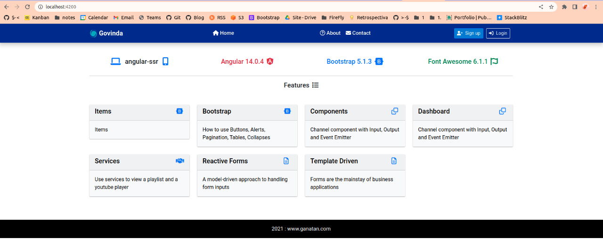
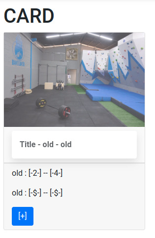

# Orfeo.Feed

## Objetivo

Pacote responsável por ler feeds apresentálos e disponibilizar um layout pra iframes.


## Como instalar

```cmd

npm install

```

## Como iniciar


```cmd

npm start

```

## Como testar


```cmd

npm test

```

## Componentes tipograficos






## Liks


- Emoj em html : https://www.science.co.il/internet/html/Smileys.php

- 🙄


